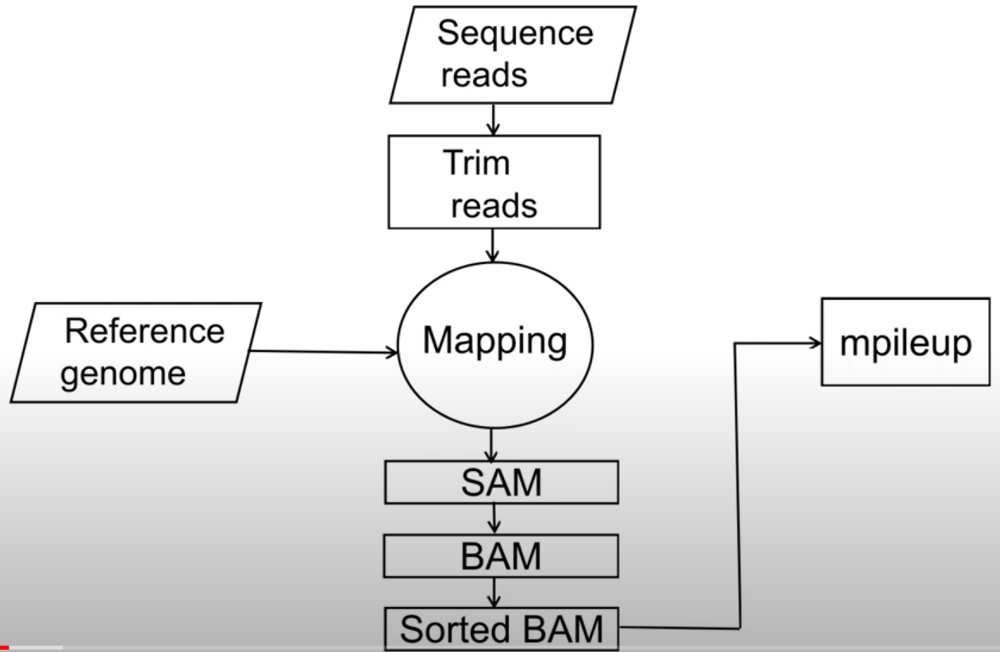

#Genome Assembly
1.Nanopore三代测序分析流程：
1) 数据预处理,使用poretools或MinKNOW等软件从Nanopore设备中获取原始FAST5数据，并使用albacore或Guppy等软件将FAST5数据转换为FASTQ格式。
2) qc,使用Nanoplot软件绘制详细的质量数据图。
3) trimming,NanoFilt或Porechop等软件进行前后端或adapter修剪.
4) 与ref对比，使用Minimap2或其他基准比对软件将经过质量过滤和修剪的reads比对到参考基因组或转录组中。
5) 组装，使用Canu或Flye等读取组装软件对基准比对后的reads进行组装。
6) 结果评估与注释,使用QUAST或其他评估工具对组装结果进行比较和评估。然后使用BUSCO或其他校准工具对基因组组装或转录组分析进行注释。
7) 数据分析,使用不同的工具和软件分析组装结果，例如基因预测，基因功能注释和基因家族分析。

2.Pacbio三代测序分析流程：
1) HifiAdapterFilt
2) Qc, FastQC 
3) assembly, Hifiasm
3) Quast

# Genome Reseqencing
1）qc
2）Genome Assembly
3）bwa软件
4）samtools进行变异检测
5）Variant Filtering
6）Annotation
#可以去看黑人小哥tutorial on snippy, bcftools and freebayes
基本流程：

# 其他好用工具
1. blast -Linux command line 见https://www.youtube.com/watch?v=1AzujLnr3RM

2. Artemis 工具使用见 https://www.youtube.com/watch?v=XrE5SK0n8y0
