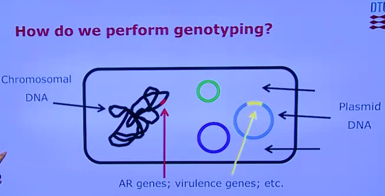
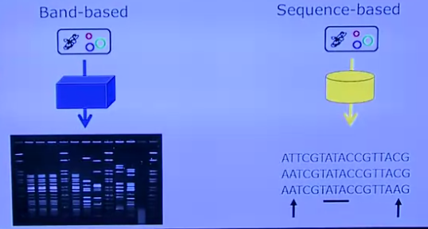
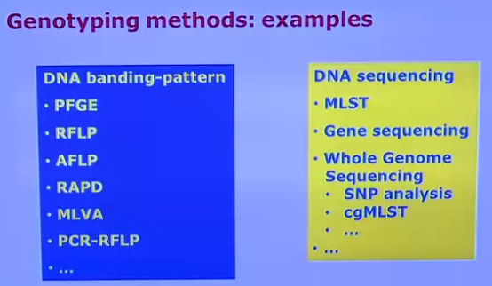
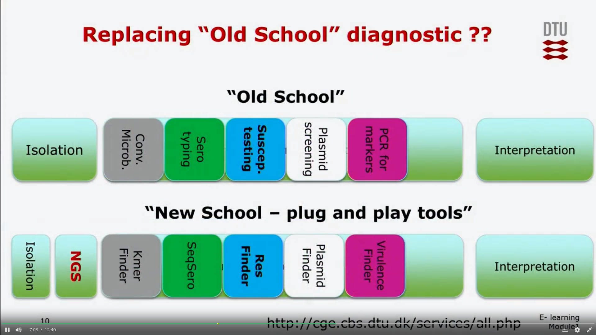
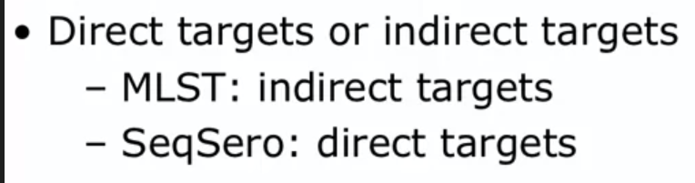
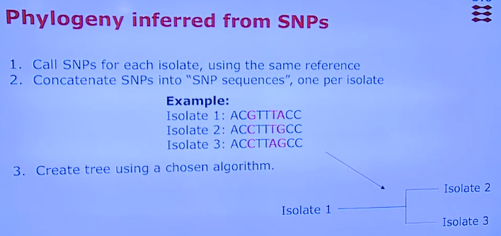
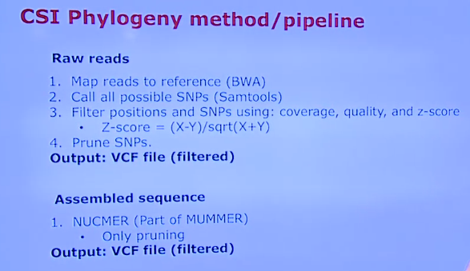
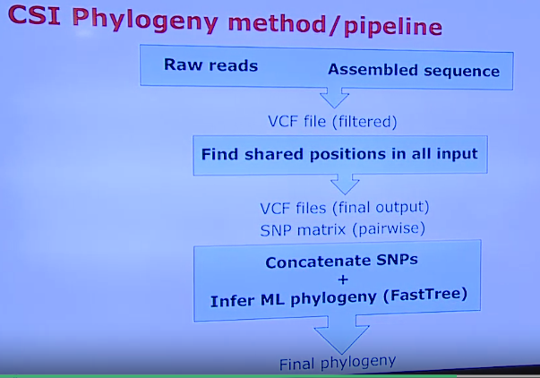
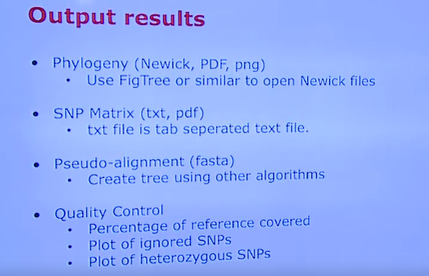
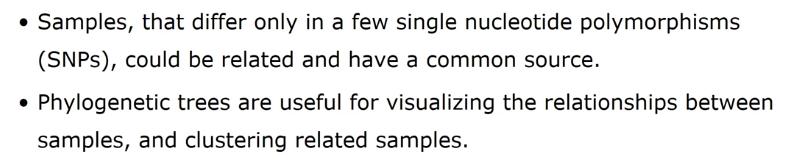

# Lesson1
## General Principles of typing of bacteria
## typing and subtyping of bacteria
Typing and subtyping of bacteria allow the differentiation of bacteria beyond the species or the subspecies level
- phenotypic:based on traits
- genotypic: based on genetic content
## How genotyping?

## genotyping methods

  - band based: Bands that can be produced by amplification by PCR, that can be produced by cutting with restriction enzymes. And at the end you will have your DNA fragmented in pieces of different sizes.
  - sequence based: sequencing

  

  
  Note:band patterns 虽然有很多种方法，But the main principle is that all this methods are based on the fact that the DNA will be fragmented and then we will separate to the fragment and we will analyze the patterns.

# Lesson2
## Surveillance of Antimicrobial Resistance using whole genome sequencing
toolbox for genomic epidemiology

Note: 网站不对外
# lesson 3
## plasmid typing
Analyze specific plasmid genes or sequences to assign plasmids to known groups.

# lesson 4
## serotype identification

Note: direct targets: locate genes that encode for the specific phenotype; indirect targets:markers that with specific phenotype.

# lesson 5
## Phylogenetic relatedness: CSI Phylogeny tool description and applications
SNP CALLING
Compared to a reference sequence

Note: CSI phylogeny involves creating phylogenetic trees, which are like family trees for species, showing their evolutionary connections.

note: Heterozygous SNPs: 假设在一个基因位置上，正常的DNA序列应该是"A"，但有些个体的这个位置上的碱基变成了"G"。如果一个个体在这个位置上有两个不同的碱基，一个是"A"，另一个是"G"，那么这个位置上就存在一个"heterozygous SNP"，表示这个个体是杂合的，也就是基因组中有两种不同的基因。

# 总结
课程不够新，大概浏览了了下, 对一些分析有个大概的了解。
